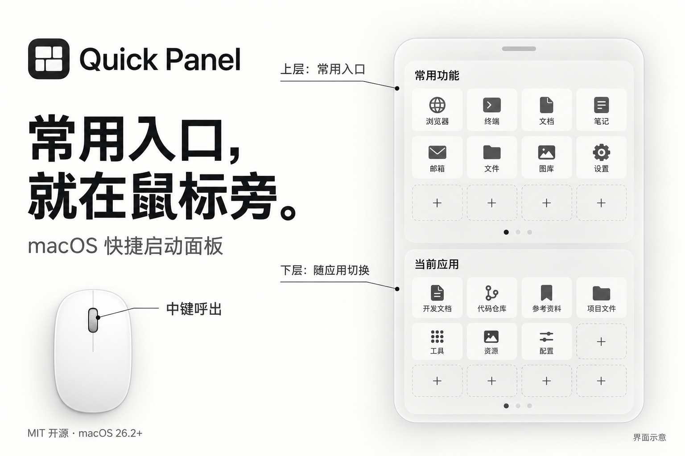

# Quick Panel

**常用入口，就在鼠标旁。**

Quick Panel 是一款 macOS 快捷启动面板。按下鼠标中键，在光标附近打开常用应用和网站；上层保留常用入口，下层展示你为当前应用配置的专属入口。

灵感来自 Quicker 的中键交互，使用 SwiftUI 与 AppKit 实现原生 macOS 体验。



*上图为功能示意，具体界面以实际运行版本为准。*

[源码仓库](https://github.com/zero-live/quick-panel) · [下载入口](https://github.com/zero-live/quick-panel/releases) · [更新记录](CHANGELOG.md) · [参与贡献](CONTRIBUTING.md) · [MIT 许可证](LICENSE)

## 为什么做 Quick Panel

打开应用、找书签、查文档，是日常工作里反复发生的小动作。Quick Panel 把这些入口放到鼠标附近，适合希望用鼠标快速访问常用工具的人。

例如，上层放浏览器、终端和笔记应用；给 Xcode 的下层配置开发文档与代码仓库，给浏览器的下层配置常用网站。再次呼出面板时，下层会根据前台应用切换。每个应用的专属入口需要自己配置。

## 功能

| 功能 | 使用方式 |
| --- | --- |
| 中键呼出 | 按下鼠标滚轮，在光标附近显示或隐藏面板；也可启用全局快捷键或使用菜单栏入口 |
| 双层面板 | 上层放通用入口，下层按前台应用展示已绑定的项目 |
| 应用与网站 | 启动本地 `.app`，或通过系统默认浏览器打开网址 |
| 快速添加 | 点击空位添加；网站支持自动获取标题和 favicon，也可选择自定义图标 |
| 分页整理 | 上下层独立分页、滚轮翻页、自定义分组标题，支持拖拽排序和跨页移动 |
| 原生外观 | 液态玻璃与多种系统毛玻璃材质，支持背景透明度、网格和间距调整 |
| 屏幕适配 | 自动按触发所在屏幕的可见区域调整面板大小，也可选择固定大小 |
| 日常使用 | 菜单栏常驻、开机自启、更新检查、应用内更新日志与调试日志导出 |

## 安装与上手

当前代码版本为 **1.5.1（Build 14）**，最低支持 **macOS 26.2**。源码、安装包及应用内更新均由 GitHub 提供。安装包供应情况请查看 [GitHub Releases](https://github.com/zero-live/quick-panel/releases)。

安装包为 Universal，支持 Apple Silicon 与 Intel。当前包使用 ad-hoc 签名，尚未进行 Apple 公证；安装要求和校验方式见 [1.5.1 发布说明](docs/releases/v1.5.1.md)。旧版本的更新地址无法访问，请从 GitHub 手动安装 1.5.1，后续版本会从 GitHub 检查更新。

1. 下载适用的 DMG，将 `Quick Panel.app` 拖入「应用程序」后打开。
2. 在「系统设置 → 隐私与安全性 → 辅助功能」中授权 Quick Panel，以稳定监听鼠标中键。
3. 点击鼠标中键，或通过菜单栏的「显示/隐藏面板」打开面板。
4. 点击上层空位添加常用应用或网址。需要专属入口时，先切到目标应用，再呼出面板，在下层添加项目。
5. 右键项目进行编辑或删除；拖拽可调整顺序，拖到左右边缘并停留可切页移动。在设置中调整网格、外观和触发快捷键。

没有带中键的鼠标时，可在「设置 → 高级」启用并自定义全局快捷键。

应用常驻菜单栏，不显示 Dock 图标。没有辅助功能权限时，会尝试备用鼠标监听方案；如果中键呼出不稳定，请检查权限并重启应用。

## 从源码运行

需要 macOS 26.2+，以及提供 macOS 26.2 或更新 SDK 的 Xcode。项目不使用第三方依赖，无需安装 SPM、CocoaPods 或 Carthage 包。

```bash
git clone https://github.com/zero-live/quick-panel.git
cd quick-panel
./run_app.sh
```

脚本会构建 Debug 版本、为 ad-hoc 构建应用稳定的调试签名要求，并重启 Quick Panel。也可打开 `Quick Panel/Quick Panel.xcodeproj`，选择 `Quick Panel` scheme 运行。

手动构建与测试：

```bash
xcodebuild -project "Quick Panel/Quick Panel.xcodeproj" \
  -scheme "Quick Panel" -configuration Debug build

xcodebuild -project "Quick Panel/Quick Panel.xcodeproj" \
  -scheme "Quick Panel" -configuration Debug test
```

运行测试前请退出已经运行的 Quick Panel，避免单实例保护使测试宿主提前退出。测试覆盖网格重排、上下文隔离、面板文档序列化和屏幕适配；窗口、权限和中键交互仍需手动验证。

## 数据与网络

面板项目和设置以 JSON 保存在本机。应用通过系统 API 定位 Application Support 目录，沙盒运行时通常位于：

```text
~/Library/Containers/com.benxin.Quick-Panel/Data/Library/Application Support/Quick Panel/
```

非沙盒环境对应 `~/Library/Application Support/Quick Panel/`。主要内容为：

- `panel.json`：项目、页面分组、页数和格式版本；保存时保留 `.backup`。
- `settings.json`：外观、快捷键等设置。
- `Icons/`：自定义图标。
- `Logs/`：本地调试日志，按天保存并保留最近 7 天。

旧版 `config.json`、`groups.json` 和 `pagecounts.json` 会迁移到 `panel.json`，原文件保留以便恢复。

添加网站时，应用会请求该网站的页面与图标；更新检查会访问 GitHub Releases API，可在高级设置中关闭自动检查。打开网址会交给浏览器。反馈问题前，请检查导出日志是否包含不希望公开的网址、名称或本地路径。

## 项目结构

```text
Quick Panel/
├── Quick Panel.xcodeproj/        # Xcode 工程
├── Quick Panel/                 # Swift 源码
│   ├── Quick_PanelApp.swift     # 应用入口
│   ├── AppDelegate.swift        # 生命周期与服务初始化
│   ├── PanelView.swift          # 当前主面板
│   ├── PanelWindowManager.swift # NSPanel 与事件路由
│   ├── Models/                 # 项目与面板文档模型
│   ├── Views/                  # 设置、添加/编辑、关于等界面
│   └── Services/               # 持久化、布局、图标、快捷键等
└── Quick PanelTests/            # 单元测试
```

主面板由 `NSPanel` 承载 SwiftUI，应用以 `.accessory` 模式运行。共享状态使用 `ObservableObject`，跨组件事件通过 `NotificationCenter` 传递。开发细节见 [CLAUDE.md](CLAUDE.md) 和 [AGENTS.md](AGENTS.md)，版本与打包流程见 [发布说明](docs/release.md)。

## 当前边界

当前版本支持应用和网站入口，尚未提供搜索、配置导入导出、指定浏览器的选择界面或完整自动化工作流。代码中的预设动作与快捷键执行模型尚未接通主面板，不属于当前可用功能。

欢迎提交问题、使用反馈和 Pull Request，详见 [贡献指南](CONTRIBUTING.md)。

## 许可证

本项目采用 [MIT License](LICENSE)。
